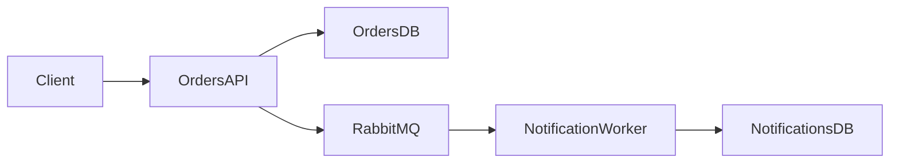

# OrderFlow — Guia de Arquitetura e Implementação

## 1. Visão Geral

**OrderFlow** é um projeto de portfólio desenvolvido com foco em demonstrar, de forma prática e didática, competências modernas do ecossistema .NET, especialmente:

- Clean Architecture
- Microsserviços
- Mensageria assíncrona com RabbitMQ
- Docker e Docker Compose
- PostgreSQL
- Entity Framework Core
- APIs REST
- Testes automatizados
- Boas práticas de arquitetura, separação de responsabilidades e integração entre serviços

O objetivo principal não é construir um sistema comercial completo, mas um projeto pequeno o suficiente para ser entendido rapidamente e completo o suficiente para demonstrar decisões arquiteturais relevantes em uma entrevista técnica.

O projeto deve priorizar clareza, manutenibilidade, organização, observabilidade e facilidade de execução local.

---

## 2. Objetivo de Negócio

O sistema representa um fluxo simplificado de pedidos.

Um usuário deve ser capaz de:

1. criar um pedido;
2. consultar pedidos;
3. consultar um pedido específico;
4. alterar o status de um pedido;
5. cancelar um pedido;
6. gerar eventos de domínio quando determinadas ações ocorrerem;
7. enviar esses eventos para o RabbitMQ;
8. processar os eventos em outro microsserviço;
9. registrar notificações decorrentes desses eventos.

O fluxo principal será:

```text
Cliente
   |
   v
Order API
   |
   +--> PostgreSQL
   |
   +--> RabbitMQ
            |
            v
     Notification Service
            |
            +--> PostgreSQL
```

---

## 3. Objetivos Técnicos

O projeto deve demonstrar:

### 3.1 Clean Architecture

Cada microsserviço deve separar suas responsabilidades em camadas/projetos independentes.

Estrutura recomendada:

```text
src/
  Services/
    Orders/
      OrderFlow.Orders.Domain/
      OrderFlow.Orders.Application/
      OrderFlow.Orders.Infrastructure/
      OrderFlow.Orders.Api/

    Notifications/
      OrderFlow.Notifications.Domain/
      OrderFlow.Notifications.Application/
      OrderFlow.Notifications.Infrastructure/
      OrderFlow.Notifications.Worker/
```

Dependências esperadas:

```text
Domain
  ^
  |
Application
  ^
  |
Infrastructure
  ^
  |
API / Worker
```

Observação:

A camada `Infrastructure` poderá depender de `Application` e `Domain`.

A camada `Application` poderá depender apenas de `Domain`.

A camada `Domain` não deverá depender de nenhum outro projeto da solução.

---

## 4. Escopo Inicial

### 4.1 Dentro do escopo

- criação de pedidos;
- consulta de pedidos;
- alteração de status;
- cancelamento;
- persistência em PostgreSQL;
- publicação de eventos no RabbitMQ;
- consumo dos eventos por outro serviço;
- persistência de notificações;
- Dockerfile para cada serviço;
- Docker Compose;
- migrations;
- tratamento global de erros;
- logs estruturados;
- testes unitários;
- alguns testes de integração;
- documentação da API com OpenAPI/Swagger;
- documentação arquitetural no README.

### 4.2 Fora do escopo inicial

Para manter o projeto pequeno, não implementar inicialmente:

- autenticação;
- autorização;
- sistema real de pagamentos;
- frontend Angular;
- envio real de e-mail;
- envio real de SMS;
- Kubernetes;
- service mesh;
- API Gateway;
- Event Sourcing;
- CQRS completo;
- Kafka;
- multi-tenant;
- integração com serviços externos reais.

Esses itens podem ser adicionados futuramente como extensões.

---

# 5. Microsserviços

## 5.1 Orders Service

Responsável pelo ciclo de vida de pedidos.

### Responsabilidades

- criar pedidos;
- consultar pedidos;
- consultar pedido por ID;
- alterar status;
- cancelar pedidos;
- validar regras de negócio;
- persistir pedidos;
- publicar eventos relevantes.

### Persistência

Banco:

```text
orderflow_orders
```

Tecnologia:

```text
PostgreSQL
```

---

## 5.2 Notifications Service

Responsável pelo processamento de eventos relacionados aos pedidos.

### Responsabilidades

- consumir eventos do RabbitMQ;
- transformar eventos recebidos em notificações;
- persistir notificações;
- registrar processamento;
- evitar processamento duplicado quando aplicável.

O serviço não precisa enviar e-mails reais.

Uma notificação poderá ser apenas um registro no banco.

Exemplo:

```json
{
  "id": "uuid",
  "orderId": "uuid",
  "type": "OrderCreated",
  "message": "Pedido criado com sucesso.",
  "createdAt": "2026-08-11T12:00:00Z"
}
```

---

# 6. Domínio de Pedidos

## 6.1 Entidade Order

Campos:

```text
Id
CustomerName
CustomerEmail
Status
TotalAmount
CreatedAt
UpdatedAt
```

### Tipos sugeridos

```text
Id              Guid
CustomerName    string
CustomerEmail   string
Status          OrderStatus
TotalAmount     decimal
CreatedAt       DateTimeOffset
UpdatedAt       DateTimeOffset?
```

---

## 6.2 OrderStatus

Enum sugerido:

```text
Pending
Processing
Completed
Cancelled
```

Fluxo de estados permitido:

```text
Pending
   |
   v
Processing
   |
   v
Completed
```

Cancelamento permitido:

```text
Pending -> Cancelled
Processing -> Cancelled
```

Não permitir:

```text
Completed -> Cancelled
Cancelled -> qualquer outro status
Completed -> Processing
```

---

# 7. Regras de Negócio

## 7.1 Criação

Um pedido deve possuir:

- nome do cliente;
- e-mail do cliente;
- valor maior que zero.

Ao ser criado:

```text
Status = Pending
CreatedAt = UTC
```

Após persistência bem-sucedida deve ser publicado:

```text
OrderCreated
```

---

## 7.2 Alteração de status

O sistema deverá validar transições.

Transições válidas:

```text
Pending -> Processing
Processing -> Completed
Pending -> Cancelled
Processing -> Cancelled
```

Qualquer outra transição deverá gerar erro de domínio.

---

## 7.3 Cancelamento

Pedido `Completed` não pode ser cancelado.

Pedido `Cancelled` não pode ser cancelado novamente.

Após cancelamento:

```text
OrderCancelled
```

deverá ser publicado.

---

## 7.4 Conclusão

Quando:

```text
Processing -> Completed
```

publicar:

```text
OrderCompleted
```

---

# 8. Eventos

## 8.1 Eventos iniciais

Implementar:

```text
OrderCreated
OrderStatusChanged
OrderCompleted
OrderCancelled
```

---

## 8.2 Estrutura padrão

Todos os eventos devem possuir um envelope semelhante a:

```json
{
  "eventId": "uuid",
  "eventType": "OrderCreated",
  "occurredAt": "2026-08-11T12:00:00Z",
  "version": 1,
  "data": {}
}
```

---

## 8.3 OrderCreated

Exemplo:

```json
{
  "eventId": "uuid",
  "eventType": "OrderCreated",
  "occurredAt": "2026-08-11T12:00:00Z",
  "version": 1,
  "data": {
    "orderId": "uuid",
    "customerName": "Luan Victor",
    "customerEmail": "example@email.com",
    "totalAmount": 150.00
  }
}
```

---

## 8.4 OrderStatusChanged

```json
{
  "eventId": "uuid",
  "eventType": "OrderStatusChanged",
  "occurredAt": "2026-08-11T12:10:00Z",
  "version": 1,
  "data": {
    "orderId": "uuid",
    "previousStatus": "Pending",
    "newStatus": "Processing"
  }
}
```

---

# 9. RabbitMQ

## 9.1 Exchange

Nome sugerido:

```text
orderflow.orders
```

Tipo:

```text
topic
```

---

## 9.2 Routing keys

```text
order.created
order.status.changed
order.completed
order.cancelled
```

---

## 9.3 Queue

Notifications Service:

```text
orderflow.notifications
```

Bindings:

```text
order.*
```

ou bindings explícitos.

Preferência inicial: bindings explícitos para facilitar entendimento.

---

## 9.4 Dead Letter Queue

Adicionar:

```text
orderflow.notifications.dlq
```

Mensagens que excederem a política de retry deverão ser direcionadas para a DLQ.

---

# 10. Retry

O consumidor deve implementar retry.

Sugestão inicial:

```text
3 tentativas
```

Estratégia:

```text
tentativa 1
espera
tentativa 2
espera
tentativa 3
DLQ
```

Não implementar retries infinitos.

---

# 11. Idempotência

O Notifications Service deve evitar processamento duplicado.

Criar tabela:

```text
ProcessedMessages
```

Campos:

```text
EventId
ProcessedAt
```

Antes de processar uma mensagem:

```text
se EventId já existir:
    ignorar
senão:
    processar
    persistir EventId
```

Isso demonstra um problema real de sistemas distribuídos.

---

# 12. Persistência

## 12.1 Orders

Tabelas iniciais:

```text
Orders
```

### Orders

```text
Id
CustomerName
CustomerEmail
Status
TotalAmount
CreatedAt
UpdatedAt
```

---

## 12.2 Notifications

Tabelas:

```text
Notifications
ProcessedMessages
```

### Notifications

```text
Id
OrderId
Type
Message
CreatedAt
```

### ProcessedMessages

```text
EventId
ProcessedAt
```

---

# 13. Entity Framework Core

Cada microsserviço possui seu próprio `DbContext`.

Exemplo:

```text
OrdersDbContext
NotificationsDbContext
```

Não compartilhar banco nem `DbContext`.

Cada serviço deve possuir suas próprias migrations.

---

# 14. APIs

## 14.1 Orders API

Base:

```text
/api/orders
```

---

## 14.2 Criar pedido

```http
POST /api/orders
```

Request:

```json
{
  "customerName": "Luan Victor",
  "customerEmail": "example@email.com",
  "totalAmount": 150
}
```

Response:

```http
201 Created
```

---

## 14.3 Listar pedidos

```http
GET /api/orders
```

Inicialmente sem paginação obrigatória.

Posteriormente poderá ser adicionada.

---

## 14.4 Consultar pedido

```http
GET /api/orders/{id}
```

Response:

```http
200 OK
```

ou:

```http
404 Not Found
```

---

## 14.5 Alterar status

```http
PATCH /api/orders/{id}/status
```

Request:

```json
{
  "status": "Processing"
}
```

---

## 14.6 Cancelar

```http
POST /api/orders/{id}/cancel
```

---

# 15. Application Layer

Responsabilidades:

- casos de uso;
- DTOs;
- interfaces;
- validação de entrada;
- abstrações externas;
- orchestramento.

Exemplos:

```text
CreateOrder
GetOrderById
GetOrders
ChangeOrderStatus
CancelOrder
```

---

# 16. Domain Layer

Responsável por:

- entidades;
- value objects;
- regras de negócio;
- enums;
- exceções de domínio;
- eventos de domínio.

Não deve possuir dependência de:

- Entity Framework;
- ASP.NET;
- RabbitMQ;
- PostgreSQL;
- bibliotecas de infraestrutura.

---

# 17. Infrastructure Layer

Responsável por:

```text
Entity Framework Core
Repositories
PostgreSQL
RabbitMQ
Message publisher
Configurações externas
```

---

# 18. Repository Pattern

Interface no núcleo apropriado:

```csharp
public interface IOrderRepository
{
    Task<Order?> GetByIdAsync(Guid id, CancellationToken cancellationToken);
    Task<IReadOnlyCollection<Order>> GetAllAsync(CancellationToken cancellationToken);
    Task AddAsync(Order order, CancellationToken cancellationToken);
    Task SaveChangesAsync(CancellationToken cancellationToken);
}
```

Implementação:

```text
Infrastructure/Persistence/Repositories/OrderRepository
```

---

# 19. Mensageria — abstração

Não utilizar RabbitMQ diretamente dentro do domínio.

Criar abstração:

```csharp
public interface IEventPublisher
{
    Task PublishAsync<T>(
        T message,
        string routingKey,
        CancellationToken cancellationToken);
}
```

Implementação concreta:

```text
RabbitMqEventPublisher
```

---

# 20. Tratamento de erros

Usar tratamento global.

Sugestão:

```text
ProblemDetails
```

Tipos de erros:

```text
ValidationException      -> 400
DomainException          -> 400 / 422
NotFoundException        -> 404
UnhandledException       -> 500
```

Nunca retornar stack trace ao cliente.

---

# 21. Validação

Pode utilizar:

```text
FluentValidation
```

ou validação manual.

Recomendação:

```text
FluentValidation
```

Exemplo:

```text
CustomerName obrigatório
CustomerEmail obrigatório e válido
TotalAmount > 0
```

---

# 22. Logs

Utilizar:

```text
Serilog
```

Logs devem ser estruturados.

Exemplo:

```csharp
Log.Information(
    "Order {OrderId} created for {CustomerEmail}",
    order.Id,
    order.CustomerEmail);
```

Evitar:

```csharp
Log.Information($"Order {order.Id} created");
```

---

# 23. Correlation ID

Cada request deve possuir um identificador.

Header:

```text
X-Correlation-ID
```

Se o cliente não enviar:

```text
gerar automaticamente
```

O Correlation ID deve ser enviado nos eventos.

Isso permitirá rastrear:

```text
HTTP Request
   |
   v
Order Service
   |
   v
RabbitMQ
   |
   v
Notification Service
```

---

# 24. Docker

Cada aplicação executável terá seu próprio `Dockerfile`.

Exemplo:

```text
Orders.Api/Dockerfile
Notifications.Worker/Dockerfile
```

Usar:

```text
multi-stage build
```

---

# 25. Docker Compose

Serviços:

```text
orders-api
notifications-worker
orders-db
notifications-db
rabbitmq
```

Estrutura:

```yaml
services:

  orders-api:
    depends_on:
      - orders-db
      - rabbitmq

  notifications-worker:
    depends_on:
      - notifications-db
      - rabbitmq

  orders-db:
    image: postgres

  notifications-db:
    image: postgres

  rabbitmq:
    image: rabbitmq:management
```

---

# 26. Health Checks

Orders API:

```text
/health
```

Verificar:

- aplicação;
- PostgreSQL;
- RabbitMQ.

Notifications Worker:

- PostgreSQL;
- RabbitMQ.

Docker Compose deverá utilizar healthchecks quando possível.

---

# 27. Configuração

Não hardcodar configurações.

Usar:

```text
appsettings.json
appsettings.Development.json
environment variables
```

Configurações:

```text
ConnectionStrings
RabbitMq
Logging
```

---

# 28. Secrets

Nunca versionar:

```text
senha real
connection string real
credenciais
```

Criar:

```text
.env.example
```

Exemplo:

```text
POSTGRES_USER=orderflow
POSTGRES_PASSWORD=change-me
RABBITMQ_DEFAULT_USER=orderflow
RABBITMQ_DEFAULT_PASS=change-me
```

`.env` deve estar no `.gitignore`.

---

# 29. Testes

## 29.1 Unitários

Priorizar domínio e aplicação.

Testar:

```text
pedido criado como Pending
pedido com valor <= 0 é inválido
Pending -> Processing permitido
Processing -> Completed permitido
Completed -> Cancelled inválido
Cancelled -> Processing inválido
```

---

## 29.2 Application

Testar casos de uso:

```text
CreateOrder
CancelOrder
ChangeStatus
```

Utilizar mocks apenas nas bordas.

---

## 29.3 Integração

Criar alguns testes de integração para:

```text
Orders API + PostgreSQL
```

Possível evolução:

```text
Testcontainers
```

Não é obrigatório na primeira versão.

---

# 30. Outbox Pattern

## Primeira versão

Pode publicar eventos imediatamente após persistência.

## Evolução recomendada

Implementar Transactional Outbox.

Objetivo:

evitar cenário:

```text
Pedido salvo
RabbitMQ indisponível
evento perdido
```

Estrutura:

```text
Orders
OutboxMessages
```

Mesma transação:

```text
salvar Order
salvar OutboxMessage
commit
```

Worker:

```text
buscar mensagens pendentes
publicar RabbitMQ
marcar como processadas
```

Esta evolução é altamente recomendada após o MVP.

---

# 31. Estrutura geral da solução

```text
OrderFlow/
|
|-- src/
|   |
|   |-- BuildingBlocks/
|   |   |-- OrderFlow.Messaging.Contracts/
|   |
|   |-- Services/
|       |
|       |-- Orders/
|       |   |
|       |   |-- OrderFlow.Orders.Domain/
|       |   |-- OrderFlow.Orders.Application/
|       |   |-- OrderFlow.Orders.Infrastructure/
|       |   |-- OrderFlow.Orders.Api/
|       |
|       |-- Notifications/
|           |
|           |-- OrderFlow.Notifications.Domain/
|           |-- OrderFlow.Notifications.Application/
|           |-- OrderFlow.Notifications.Infrastructure/
|           |-- OrderFlow.Notifications.Worker/
|
|-- tests/
|   |
|   |-- Orders/
|   |   |-- OrderFlow.Orders.Domain.Tests/
|   |   |-- OrderFlow.Orders.Application.Tests/
|   |   |-- OrderFlow.Orders.IntegrationTests/
|   |
|   |-- Notifications/
|       |-- OrderFlow.Notifications.Tests/
|
|-- docker-compose.yml
|-- .env.example
|-- .gitignore
|-- README.md
|-- ARCHITECTURE.md
|-- OrderFlow.sln
```

---

# 32. Contratos compartilhados

Criar projeto:

```text
OrderFlow.Messaging.Contracts
```

Ele deve possuir apenas contratos necessários à comunicação.

Exemplo:

```text
OrderCreatedIntegrationEvent
OrderCompletedIntegrationEvent
OrderCancelledIntegrationEvent
```

Não compartilhar:

```text
Entities
Repositories
DbContexts
Domain Services
```

Microsserviços devem manter independência.

---

# 33. Domain Event x Integration Event

Distinguir:

## Domain Event

Evento interno do domínio.

Exemplo:

```text
OrderCreatedDomainEvent
```

## Integration Event

Contrato publicado externamente.

Exemplo:

```text
OrderCreatedIntegrationEvent
```

Fluxo:

```text
Domain
   |
Domain Event
   |
Application
   |
Integration Event
   |
RabbitMQ
```

Essa separação deve ser documentada.

---

# 34. API Versioning

Não necessário no MVP.

Possível evolução:

```text
/api/v1/orders
```

---

# 35. Swagger

Orders API deverá possuir Swagger/OpenAPI.

No ambiente Development:

```text
/swagger
```

Documentar:

- endpoints;
- requests;
- responses;
- códigos HTTP.

---

# 36. README

README deve permitir que um recrutador entenda o projeto rapidamente.

Estrutura:

```text
# OrderFlow

## Objetivo

## Arquitetura

## Tecnologias

## Fluxo de eventos

## Como executar

## Endpoints

## Decisões arquiteturais

## Testes

## Próximas evoluções
```

---

# 37. Diagrama no README

Adicionar Mermaid:



---

# 38. Tecnologias planejadas

## Backend

```text
.NET 9
ASP.NET Core
C#
Entity Framework Core
```

## Dados

```text
PostgreSQL
```

## Mensageria

```text
RabbitMQ
```

## Containers

```text
Docker
Docker Compose
```

## Testes

```text
xUnit
```

## Logging

```text
Serilog
```

## API

```text
Swagger / OpenAPI
```

---

# 39. Critérios de aceite do MVP

O MVP estará completo quando:

- [ ] aplicação compilar;
- [ ] todos os containers subirem com `docker compose up`;
- [ ] Orders API conectar ao PostgreSQL;
- [ ] Notifications Service conectar ao próprio PostgreSQL;
- [ ] ambos conectarem ao RabbitMQ;
- [ ] pedido puder ser criado;
- [ ] pedido puder ser consultado;
- [ ] status puder ser alterado;
- [ ] pedido puder ser cancelado;
- [ ] regras de transição de estado forem respeitadas;
- [ ] `OrderCreated` for publicado;
- [ ] `OrderCompleted` for publicado;
- [ ] `OrderCancelled` for publicado;
- [ ] Notifications Service consumir mensagens;
- [ ] notificações forem persistidas;
- [ ] mensagens duplicadas não gerarem notificações duplicadas;
- [ ] erros HTTP utilizarem padrão consistente;
- [ ] Swagger estiver disponível;
- [ ] testes principais estiverem passando;
- [ ] README permitir subir o projeto do zero.

---

# 40. Evoluções após MVP

Depois do MVP, implementar gradualmente:

## Etapa 1

```text
Transactional Outbox
```

## Etapa 2

```text
Redis
```

Uso possível:

```text
cache de consulta de pedidos
```

## Etapa 3

```text
OpenTelemetry
```

Adicionar:

```text
traces
metrics
```

## Etapa 4

```text
Application Insights
```

caso seja publicado em Azure.

## Etapa 5

```text
GitHub Actions
```

Pipeline:

```text
restore
build
test
docker build
```

## Etapa 6

Deploy em Azure.

Possibilidades:

```text
Azure Container Apps
Azure App Service
Azure Container Registry
```

---

# 41. Restrições arquiteturais

Durante o desenvolvimento, a IA deve respeitar:

1. não colocar regra de negócio em Controllers;
2. não acessar EF Core diretamente do Controller;
3. não utilizar RabbitMQ dentro do Domain;
4. não compartilhar DbContext entre microsserviços;
5. não compartilhar entidades de domínio;
6. não utilizar banco compartilhado;
7. não criar dependência entre Domain e Infrastructure;
8. não transformar o projeto em um framework genérico;
9. evitar abstrações sem necessidade;
10. priorizar código simples e legível.

---

# 42. Princípios de implementação

Priorizar:

```text
KISS
SOLID
Clean Code
Separation of Concerns
Dependency Inversion
Fail Fast
```

Evitar overengineering.

Antes de criar uma abstração, perguntar:

```text
Existe mais de uma implementação?
Existe uma fronteira externa?
Essa abstração melhora testabilidade?
Ela representa uma responsabilidade real?
```

---

# 43. Convenções de código

## Async

I/O deve ser assíncrono.

Utilizar:

```text
async / await
CancellationToken
```

---

## Datas

Utilizar UTC.

Preferência:

```text
DateTimeOffset.UtcNow
```

---

## IDs

Utilizar:

```text
Guid
```

---

## Nullable Reference Types

Habilitar:

```xml
<Nullable>enable</Nullable>
```

---

## Implicit Usings

Permitido.

---

# 44. Estratégia para desenvolvimento com IA

A IA que implementar este projeto deve seguir este documento como fonte principal de arquitetura.

Antes de implementar uma tarefa:

1. identificar o microsserviço afetado;
2. identificar a camada correta;
3. verificar dependências permitidas;
4. verificar contratos existentes;
5. implementar apenas o escopo solicitado;
6. não antecipar funcionalidades de etapas futuras;
7. criar ou atualizar testes relacionados;
8. atualizar documentação quando necessário;
9. manter compatibilidade com Docker Compose;
10. garantir que o projeto continue compilando.

---

# 45. Regra para mudanças arquiteturais

A IA não deve alterar decisões arquiteturais descritas neste documento silenciosamente.

Caso uma tarefa exija mudança arquitetural:

1. explicar a necessidade;
2. apresentar a alternativa;
3. indicar impactos;
4. aguardar decisão antes de alterar a arquitetura principal.

---

# 46. Definition of Done

Uma tarefa só estará concluída quando:

- código implementado;
- projeto compilando;
- testes existentes passando;
- novos testes adicionados quando necessários;
- sem código morto;
- sem credenciais versionadas;
- logs adequados;
- tratamento de erros adequado;
- arquitetura respeitada;
- documentação atualizada se a tarefa alterar comportamento ou configuração.

---

# 47. Resultado esperado para portfólio

Ao final, o projeto deve permitir demonstrar em entrevistas:

- como organizar uma aplicação .NET com Clean Architecture;
- como separar responsabilidades entre microsserviços;
- como realizar comunicação assíncrona;
- como utilizar RabbitMQ;
- como lidar com mensagens duplicadas;
- como pensar em retries e DLQ;
- como containerizar serviços;
- como separar bancos por serviço;
- como testar domínio e aplicação;
- como estruturar logs e correlation IDs;
- como evoluir um sistema distribuído sem torná-lo excessivamente complexo.

O projeto deve ser pequeno o suficiente para ser explicado em aproximadamente 5 a 10 minutos durante uma entrevista técnica.

---

# 48. Resumo da Arquitetura

```text
                    +------------------+
                    |     Cliente      |
                    +--------+---------+
                             |
                             v
                    +------------------+
                    |    Orders API    |
                    |     .NET 9       |
                    +----+--------+----+
                         |        |
                         |        |
                         v        v
                  +---------+   +-----------+
                  | Orders  |   | RabbitMQ  |
                  |   DB    |   +-----+-----+
                  +---------+         |
                                      |
                                      v
                           +----------------------+
                           | Notifications Worker |
                           |        .NET 9        |
                           +----------+-----------+
                                      |
                                      v
                           +----------------------+
                           | Notifications DB     |
                           +----------------------+
```

---

# 49. Decisão central do projeto

Este projeto não deve tentar provar domínio de dezenas de ferramentas.

Ele existe para demonstrar com profundidade razoável um conjunto pequeno de competências importantes:

```text
.NET
Clean Architecture
Microsserviços
RabbitMQ
PostgreSQL
Docker
Testes
Boas práticas
```

Toda decisão futura deve respeitar esse objetivo.
