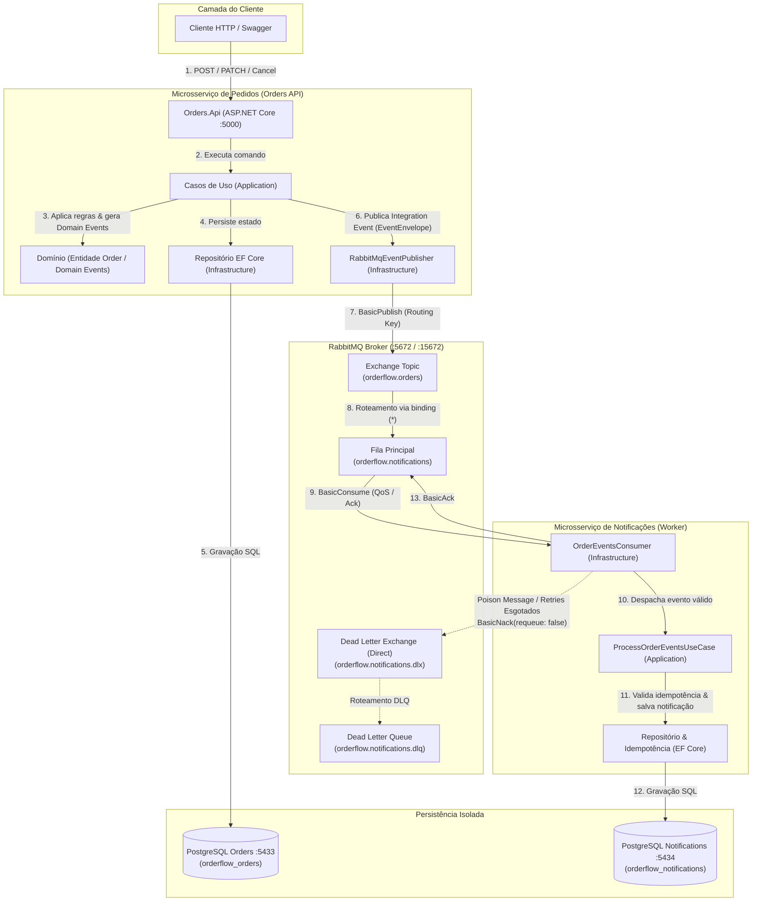

# OrderFlow

O **OrderFlow** é um ecossistema de microsserviços distribuídos orientado a eventos (EDA - Event-Driven Architecture), construído em **.NET 9 (C# 13)**. O projeto resolve o problema de processamento assíncrono e desacoplado do ciclo de vida de pedidos em sistemas distribuídos, demonstrando padrões arquiteturais de nível de produção como Clean Architecture, isolamento rigoroso de persistência (Database-per-Service), mensageria resiliente com RabbitMQ (Topic Exchange, Retry com backoff exponencial e Dead Letter Queue), processamento idempotente e observabilidade estruturada ponta a ponta com rastreabilidade distribuída.

---

## 🛠️ Tecnologias e Ferramentas

| Categoria | Tecnologia | Finalidade no Projeto |
| :--- | :--- | :--- |
| **Runtime & Linguagem** | **.NET 9 (C# 13)** | Plataforma principal de desenvolvimento com recursos modernos de C# |
| **Web API** | **ASP.NET Core** | Endpoints RESTful com injeção de dependência, Swagger e `ProblemDetails` |
| **Worker Service** | **.NET BackgroundService** | Consumo contínuo de mensagens AMQP em processo isolado |
| **Acesso a Dados** | **Entity Framework Core 9** | Mapeamento ORM, migrations automáticas e isolamento relacional |
| **Banco de Dados** | **PostgreSQL 17** | Instâncias independentes por microsserviço (Database-per-Service) |
| **Mensageria** | **RabbitMQ 3** | Broker de mensageria com Topic Exchange, DLX/DLQ e Consumer Acks |
| **Logs & Rastreabilidade** | **Serilog** | Logs estruturados (`clef` JSON / texto) e propagação de `CorrelationId` |
| **Testes Automatizados** | **xUnit, Moq, FluentAssertions** | Testes unitários de domínio e aplicação com cobertura de regras de negócio |
| **Testes de Integração** | **WebApplicationFactory & Testcontainers** | Testes de integração HTTP e persistência contra instâncias reais de PostgreSQL |
| **Containerização** | **Docker & Docker Compose** | Ambientes reproduzíveis, healthchecks e orquestração de múltiplos serviços |

---

## 🏗️ Arquitetura do Sistema



---

## 🏛️ Padrões e Conceitos Arquiteturais

### 1. Clean Architecture por Microsserviço
Cada serviço (`Orders` e `Notifications`) adota uma estrutura em camadas com regra de dependência estritamente unidirecional voltada para o centro:

```text
src/Services/Orders/
├── OrderFlow.Orders.Domain/         # Entidades, Value Objects, Domain Events e Enums (Sem dependências externas)
├── OrderFlow.Orders.Application/    # Casos de Uso, DTOs, Mapeamentos e Interfaces de Repositório/Publisher
├── OrderFlow.Orders.Infrastructure/ # Implementações de IOrderRepository (EF Core), RabbitMQ Publisher e Migrations
└── OrderFlow.Orders.Api/             # Controllers REST, Middlewares de CorrelationId e Exception Handling
```

* **Domain**: Não conhece frameworks, ORMs ou bancos de dados. Regras de transição de status (`Pending -> Processing -> Completed / Cancelled`) e validações de invariantes residem na própria entidade `Order`.
* **Application**: Orquestra os fluxos de negócio através de Use Cases (`CreateOrderUseCase`, `ChangeOrderStatusUseCase`, etc.).
* **Infrastructure**: Implementa contratos de persistência e comunicação externa (PostgreSQL, RabbitMQ).
* **Presentation / Worker**: Ponto de entrada da aplicação (API HTTP ou Background Consumer).

### 2. Isolamento de Persistência (Database-per-Service)
* **Sem DbContext ou Entidades Compartilhadas**: Os microsserviços `Orders` e `Notifications` operam com bancos de dados PostgreSQL completamente separados em portas distintas (`5433` e `5434`).
* **Baixo Acoplamento**: Alterações no schema de pedidos não quebram o serviço de notificações. A única superfície de contrato entre os microsserviços é a biblioteca compartilhada `OrderFlow.Messaging.Contracts`.
* **Escala Independente**: Cada serviço pode ter suas instâncias de banco dimensionadas, migradas e tunadas conforme sua carga operacional.

### 3. Domain Events vs Integration Events
* **Domain Events** (ex: `OrderCreatedDomainEvent`):
  * Ocorrem em memória, no mesmo processo, dentro do limite do microsserviço de `Orders`.
  * Expressam uma mudança de estado que ocorreu no agregado `Order` para sincronização interna ou disparo de regras locais.
* **Integration Events** (ex: `OrderCreatedIntegrationEvent`):
  * Publicados no RabbitMQ envelopados no formato `EventEnvelope<T>`.
  * Projetados para comunicação assíncrona entre diferentes *Bounded Contexts*.
  * Carregam apenas os dados necessários para que consumidores externos reajam ao evento sem vazar detalhes internos do domínio de origem.

---

## 📬 Mensageria, Resiliência e Idempotência

### Topologia RabbitMQ

| Elemento | Nome / Tipo | Configuração | Detalhes |
| :--- | :--- | :--- | :--- |
| **Exchange Principal** | `orderflow.orders` (Topic) | `Durable: true` | Ponto de publicação dos eventos de integração da Orders API |
| **Fila Principal** | `orderflow.notifications` | `Durable: true`, Prefetch: 10 | Vinculada à exchange via routing keys com DLX configurado |
| **Dead Letter Exchange (DLX)** | `orderflow.notifications.dlx` (Direct) | `Durable: true` | Recebe mensagens rejeitadas definitivamente |
| **Dead Letter Queue (DLQ)** | `orderflow.notifications.dlq` | `Durable: true` | Retém poison messages e falhas para análise técnica |

### Routing Keys e Eventos de Integração

* `order.created` $\rightarrow$ `OrderCreatedIntegrationEvent`
* `order.status.changed` $\rightarrow$ `OrderStatusChangedIntegrationEvent`
* `order.completed` $\rightarrow$ `OrderCompletedIntegrationEvent`
* `order.cancelled` $\rightarrow$ `OrderCancelledIntegrationEvent`

### Políticas de Resiliência no Consumidor

1. **Retry com Backoff Exponencial**:
   Falhas transitórias (indisponibilidade temporária de banco, concorrência ou timeout de rede) acionam até **3 tentativas de processamento** com atraso incremental ($500\text{ms} \times 2^{\text{tentativa}-1}$).
2. **Tratamento Imediato de Poison Messages**:
   Mensagens com payload corrompido (JSON inválido, campos obrigatórios ausentes, `EventType` não suportado) são rejeitadas imediatamente com `BasicNack(requeue: false)`, indo direto para a DLQ sem desperdiçar ciclos de retry.
3. **Processamento Idempotente**:
   O worker consulta a tabela `ProcessedMessages` no banco de notificações. Se o `EventId` recebido no envelope já tiver sido processado com sucesso, a mensagem recebe `BasicAck` imediatamente e a notificação não é duplicada.
4. **Confirmação Estrita (Manual Acknowledgment)**:
   Nenhuma mensagem é confirmada automaticamente. O `BasicAck` só é enviado após a persistência segura no banco de dados.

---

## 🚀 Como Executar o Projeto

### Pré-requisitos
* **Docker** (versão 24+) e **Docker Compose** instalados; ou
* **.NET 9 SDK** (caso queira rodar os testes ou compilar localmente).

---

### 1. Execução Completa via Docker Compose

1. **Clonar o repositório**:
   ```bash
   git clone https://github.com/LuanVRD/order-flow.git
   cd order-flow
   ```

2. **Configurar o arquivo de ambiente**:
   ```bash
   # Linux / macOS:
   cp .env.example .env

   # Windows (PowerShell):
   Copy-Item .env.example .env
   ```

3. **Iniciar todos os serviços em segundo plano**:
   ```bash
   docker compose up --build -d
   ```

4. **Verificar o status dos containers**:
   ```bash
   docker compose ps
   ```

5. **Acompanhar logs estruturados em tempo real**:
   ```bash
   docker compose logs -f
   ```

6. **Parar a infraestrutura**:
   ```bash
   docker compose down -v
   ```

---

### 2. Endereços e Portas de Acesso

| Serviço | URL / Endereço | Credenciais / Notas |
| :--- | :--- | :--- |
| 🌐 **Orders API (Swagger UI)** | [http://localhost:5000/swagger](http://localhost:5000/swagger) | Documentação interativa da API |
| 🐰 **RabbitMQ Management** | [http://localhost:15672](http://localhost:15672) | Usuário: `guest` \| Senha: `guest` |
| 🐘 **Orders Database (PostgreSQL)** | `localhost:5433` | Database: `orderflow_orders` \| User/Pass: `postgres`/`postgres` |
| 🐘 **Notifications DB (PostgreSQL)** | `localhost:5434` | Database: `orderflow_notifications` \| User/Pass: `postgres`/`postgres` |

---

## 📡 Endpoints da Orders API

### 1. Criar um Novo Pedido
* **Rota**: `POST /api/orders`
* **Exemplo cURL**:
  ```bash
  curl -X POST http://localhost:5000/api/orders \
    -H "Content-Type: application/json" \
    -H "X-Correlation-ID: 9b1deb4d-3b7d-4bad-9bdd-2b0d7b3dcb6d" \
    -d '{
      "customerName": "Luan Silva",
      "customerEmail": "luan@example.com",
      "totalAmount": 199.90
    }'
  ```
* **Resposta (`201 Created`)**:
  ```json
  {
    "id": "a3f5f8b9-1234-4567-89ab-cdef01234567",
    "customerName": "Luan Silva",
    "customerEmail": "luan@example.com",
    "totalAmount": 199.90,
    "status": "Pending",
    "createdAt": "2026-09-08T16:45:00.000Z",
    "updatedAt": null
  }
  ```

### 2. Listar Todos os Pedidos
* **Rota**: `GET /api/orders`
* **Exemplo cURL**:
  ```bash
  curl -X GET http://localhost:5000/api/orders
  ```

### 3. Consultar Pedido por ID
* **Rota**: `GET /api/orders/{id}`
* **Exemplo cURL**:
  ```bash
  curl -X GET http://localhost:5000/api/orders/a3f5f8b9-1234-4567-89ab-cdef01234567
  ```

### 4. Atualizar Status do Pedido
* **Rota**: `PATCH /api/orders/{id}/status`
* **Exemplo cURL**:
  ```bash
  curl -X PATCH http://localhost:5000/api/orders/a3f5f8b9-1234-4567-89ab-cdef01234567/status \
    -H "Content-Type: application/json" \
    -d '{
      "newStatus": "Processing"
    }'
  ```

### 5. Cancelar Pedido
* **Rota**: `POST /api/orders/{id}/cancel`
* **Exemplo cURL**:
  ```bash
  curl -X POST http://localhost:5000/api/orders/a3f5f8b9-1234-4567-89ab-cdef01234567/cancel
  ```

---

## 🧪 Estratégia e Execução de Testes

A suíte de testes cobre as principais camadas do sistema com pirâmide balanceada:

1. **Testes de Domínio (`OrderFlow.Orders.Domain.Tests`)**:
   Validação isolada das regras de negócio e transições de status da entidade `Order` (`Pending` $\rightarrow$ `Processing` $\rightarrow$ `Completed` / `Cancelled`), impedindo transições inválidas (ex: cancelar pedido concluído) sem dependências externas.
2. **Testes de Aplicação (`OrderFlow.Orders.Application.Tests` e `OrderFlow.Notifications.Tests`)**:
   Validação dos Casos de Uso com *Mocks*, publicação de envelopes com `CorrelationId` e testes de idempotência contra duplicatas de mensagens.
3. **Testes de Integração HTTP (`OrderFlow.Orders.IntegrationTests`)**:
   Validação de controllers e middlewares com `WebApplicationFactory` simulando requisições REST completas com validação de `ProblemDetails` e headers.
4. **Testes de Persistência com PostgreSQL Real (`Testcontainers`)**:
   Testes de repositório executados contra instâncias reais de PostgreSQL em containers efêmeros via **Testcontainers.PostgreSql**, garantindo validação de schemas, tipos nativos e constraints.

### Comandos de Teste

```bash
# Executar toda a suíte de testes da solução:
dotnet test

# Executar apenas testes de domínio de Orders:
dotnet test tests/Orders/OrderFlow.Orders.Domain.Tests/

# Executar apenas testes de aplicação de Orders:
dotnet test tests/Orders/OrderFlow.Orders.Application.Tests/

# Executar testes do serviço de Notificações:
dotnet test tests/Notifications/OrderFlow.Notifications.Tests/

# Executar testes de integração (Controllers + PostgreSQL):
dotnet test tests/Orders/OrderFlow.Orders.IntegrationTests/
```

---

## ⚖️ Decisões Arquiteturais e Trade-offs

### 1. Topic Exchange vs Direct / Fanout
* **Decisão**: Utilizou-se `Topic Exchange` (`orderflow.orders`) com routing keys hierárquicas (`order.created`, `order.status.changed`, etc.).
* **Justificativa**: Permite que novos microsserviços (ex: Faturamento, Logística, Analytics) assinem apenas tópicos específicos usando padrões curinga (ex: `order.*` ou `order.cancelled`) sem alterar a Orders API.

### 2. Database-per-Service vs Shared Database
* **Decisão**: Bancos de dados PostgreSQL físicos e lógicos isolados por serviço.
* **Justificativa**: Garante desacoplamento operacional e autonomia de evolução de schema.
* **Trade-off**: Impossibilita *JOINs* relacionais diretos e transações ACID distribuídas (2PC), exigindo consistência eventual e propagação de dados via eventos.

### 3. Publicação Direta vs Transactional Outbox (Limitação Atual do MVP)
* **Decisão no MVP**: A `Orders API` realiza o commit da transação no PostgreSQL e, em seguida, efetua o `BasicPublish` no RabbitMQ via conexão persistente.
* **Trade-off e Limitação**: Em caso de falha de rede ou queda do processo exatamente entre o commit no banco e o envio ao broker, o evento pode ser perdido (inconsistência eventual).
* **Solução para Produção**: Implementação do **Transactional Outbox Pattern** (gravação do evento em uma tabela `Outbox` na mesma transação atômica do pedido, com posterior despacho garantido por Worker ou Debezium CDC).

---

## 🔮 Próximas Evoluções (Roadmap pós-MVP)

As seguintes melhorias representam evoluções naturais para um ambiente de produção em larga escala:

- [ ] **Transactional Outbox Pattern**: Garantir entrega atômica *at-least-once* de eventos entre o banco relacional e o RabbitMQ.
- [ ] **Distributed Caching com Redis**: Cache de leitura para consultas de pedidos (`GET /api/orders/{id}`) com invalidação por eventos.
- [ ] **OpenTelemetry & Tracing Distribuído**: Exportação nativa de traces e métricas (OTLP) para Jaeger, Tempo e Grafana.
- [ ] **Pipeline CI/CD**: Automação de compilação, análise estática de código (SonarQube) e execução de testes no GitHub Actions.
- [ ] **Cloud Deployment**: Implantação do ecossistema no Azure utilizando **Azure Container Apps**, **Azure Database for PostgreSQL Flexible Server** e **Azure Service Bus**.

---

## 📄 Licença

Este projeto está sob a licença [MIT](LICENSE).
